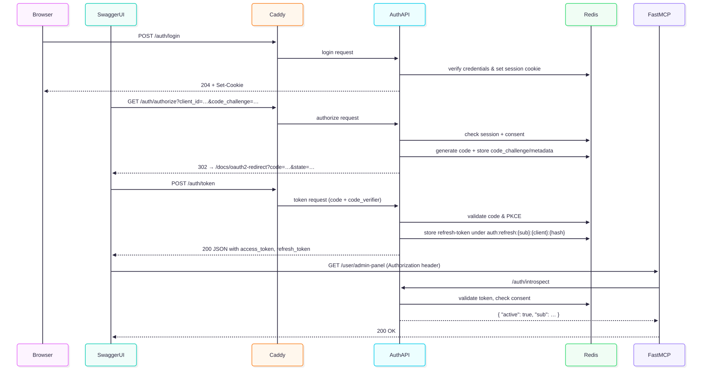

# MCP Demo
Demo of various MCP features.

<!-- Badges -->
<p style="text-align: center;">
  <a href="https://github.com/econchick/interrogate">
    
  </a>
  &nbsp;
  <a href="https://github.com/pylint-dev/pylint">
    
  </a>
</p>

## Table of Contents

- [Setup Instructions](#setup-instructions)
- [Local Startup Instructions](#local-startup-instructions)
- [Local Clean up Instructions](#local-clean-up-instructions)
- [Dev Startup Instructions](#dev-startup-instructions)
- [Dev Clean up Instructions](#dev-clean-up-instructions)
- [Full OAuth 2.1 Authorization Code + PKCE Flow with Swagger UI](#full-oauth-21-authorization-code--pkce-flow-with-swagger-ui)

## Setup Instructions

1. Install [direnv](https://direnv.net/docs/installation.html).
2. Install the latest version of [uv](https://docs.astral.sh/uv/) using: `curl -LsSf https://astral.sh/uv/install.sh | sh`
3. Run `git clone git@github.com:IDinsight/MCPDemo.git` and cd into the root directory of the repo.
4. Copy the **root** `.template.env` to `.env` and update the following environment variables in `.env`:
    1. `AUTH_RSA_PASSPHRASE`: Run `openssl rand -base64 48` in terminal to generate a random passphrase.
    2. `CSRF_SECRET_KEY`: Run `openssl rand -base64 32` in terminal to generate a random CSRF secret key.
    3. `PATHS_PROJECT_DIR`: Set this to the absolute path of the root directory of the repo.
    4. `PATHS_SECRETS_DIR`: Set this to `PATHS_PROJECT_DIR/secrets`.
5. Allow `direnv` to load the root environment variables by running `direnv allow`.
6. **[OPTIONAL (ONLY IF YOU WANT TO RUN IN DEV ENVIRONMENT)]** cd in the cicd/deployment/docker-compose directory of the repo and copy `docker-compose/.template.env` to `docker-compose/.env` and update:
    1. `AUTH_RSA_PASSPHRASE`: Run `openssl rand -base64 48` in terminal to generate a random passphrase.
    2. `CADDY_BACKEND_ROOT_API`: Set this to `/api`.
    3. `CADDY_BACKEND_ROOT_MCP`: Set this to `/mcp`.
    4. `CADDY_DOMAIN_NAME`: Set this to `dev.localhost`.
    5. `CSRF_SECRET_KEY`: Run `openssl rand -base64 32` in terminal to generate a random CSRF secret key.
    6. `PATHS_PROJECT_DIR`: Set this to the absolute path of the root directory of the repo.
    7. `PATHS_SECRETS_DIR`: Set this to `PATHS_PROJECT_DIR/secrets`.
7. cd into the backend directory of the repo and:
    1. Copy `backend/.template.env` to `backend/.env`.
    2. Allow `direnv` to load the backend environment variables by running `direnv allow`.

## Local Startup Instructions

1. **[OPTIONAL]** If you started the dev environment first, then from the root directory, run `make down-dev` to stop all dev environment containers.
2. From the root directory, run `make up-local`. This will initialize the Docker containers for the local environment.
3. cd into the backend directory of the repo and:
    1. Run `make fresh-env`. This will create a new virtual environment for the backend and install all dependencies.
    2. Run `source .venv/bin/activate`: This will activate the virtual environment created by `make fresh-env`.
4. **Starting FastAPI**
    1. From the backend directory, run `python src/mcp_demo/entries/fastapi_app.py`: This will start the FastAPI server on `http://localhost:8000`.
    2. Go to [http://localhost:8000/docs](http://localhost:8000/docs) to view and interact with the backend API routes.
5. **Initialize user and client**
    1. Create a new user using the `/user/register-first-user` endpoint in the FastAPI docs. Use the following payload:
        - `username`: `user1`
        - `password`: `user1`
        - You should see the following response:
          ```json
          {
              "username": "user1",
              "user_id": 1,
              "created_by": "user1",
              "recovery_codes": [
                   ...
              ],
              "scopes": [
                  "admin"
              ]
          }
          ```
    2. Create a new client using the `/client/register-first-client` endpoint in the FastAPI docs. Use the following payload (everything else can be left as their defaults):
        - `client_id`: `client1`
        - `scopes`: `["admin"]`
        - `secret`: `client1`
        - You should see the following response:
          ```json
          {
              "client_id": "client1",
              "allowed_code_challenge_methods": [
                  "S256"
              ],
              "created_by": "client1",
              "created_datetime_utc": ...,
              "is_active": true,
              "pkce_enforced": true,
              "redirect_uris": [
                  "http://dev.localhost:8000/docs/oauth2-redirect",
                  "https://api.example.com/docs/oauth2-redirect"
              ],
              "scopes": ["admin"],
              "updated_datetime_utc": ...
          }
          ```
6. **Starting Main MCP Server**
    1. From the backend directory, run `python src/mcp_demo/entries/mcp_server_main.py` in another terminal window: This will start the main MCP server on `http://localhost:8100`.
7. **Starting External MCP Server**
    1. From the backend directory, run `python src/mcp_demo/entries/mcp_server_external.py` in another terminal window: This will start the external MCP server on `http://localhost:8200`.
8. **Calling Servers With MCP Client**
    1. From the backend directory, run `python src/mcp_demo/entries/client_call.py --grant-type=password --include-external-servers --username=user1 --password=user1` in another terminal window: This will start the MCP client with Password grant type and make calls to the main and external MCP servers.
    2. From the backend directory, run `python src/mcp_demo/entries/client_call.py --grant-type=client_credentials --include-external-servers --username=client1 --password=client1` in another terminal window: This will start the MCP client with Client Credentials grant type and make calls to the main and external MCP servers.
    3. From the backend directory, run `python src/mcp_demo/entries/client_call.py --grant-type=pkce --include-external-servers --username=user1 --password=user1` in another terminal window: This will start the MCP client with Authorization Code (+ PKCE) grant type and make calls to the main and external MCP servers. In this scenario, `user1` grants `admin` permission to `client1` in order to make calls to the MCP servers.

## Local Clean up Instructions

1. Ctrl-C to stop the FastAPI server, main MCP server, and external MCP server in each of their respective terminal windows.
2. In the backend directory, run `deactivate`. This will exit out of the virtual environment created by `uv`.
3. cd back to the root directory and run `make down-local`. This will stop all local containers.
4. **[OPTIONAL]** In the root directory, run `make clean-docker`. This will remove all Docker images and containers created during the local testing setup. Use this command with caution as it will remove all Docker images and containers, not just those related to this project.

## Dev Startup Instructions
1. **[OPTIONAL]** If you started the local environment first, then from the root directory, run `make down-local` to stop all local environment containers.
2. From the root directory, run `make up-dev`. This will initialize the Docker containers for the dev environment using Docker compose.
3. cd into the backend directory of the repo.
    1. Run `make fresh-env`. This will create a new virtual environment for the backend and install all dependencies.
    2. Run `source .venv/bin/activate`: This will activate the virtual environment created by `make fresh-env`.
4. **Initialize user and client**
    1. Go to [http://localhost:8000/docs](http://localhost:8000/docs) to view and interact with the backend API routes.
    2. Create a new user using the `/user/register-first-user` endpoint in the FastAPI docs. Use the following payload:
        - `username`: `user1`
        - `password`: `user1`
        - You should see the following response:
          ```json
          {
              "username": "user1",
              "user_id": 1,
              "created_by": 1,
              "recovery_codes": [
                  ...,
              ],
              "scopes": [
                  "admin"
              ]
          }
          ```
    3. Create a new client using the `/client/register-first-client` endpoint in the FastAPI docs. Use the following payload (everything else can be left as their defaults):
        - `client_id`: `client1`
        - `scopes`: `["admin"]`
        - `secret`: `client1`
        - You should see the following response:
          ```json
          {
              "client_id": "client1",
              "allowed_code_challenge_methods": [
                  "S256"
              ],
              "created_by": "client1",
              "created_datetime_utc": ...,
              "is_active": true,
              "pkce_enforced": true,
              "redirect_uris": [
                  "http://dev.localhost:8000/docs/oauth2-redirect",
                  "https://api.example.com/docs/oauth2-redirect"
              ],
              "scopes": ["admin"],
              "updated_datetime_utc": ...
          }
          ```
5. **Calling Servers With MCP Client (NB: No External Server Here)**
    1. From the backend directory, run `python src/mcp_demo/entries/client_call.py --grant-type=password --username=user1 --password=user1` in another terminal window: This will start the MCP client with Password grant type and make calls to the **main server only**.
    2. From the backend directory, run `python src/mcp_demo/entries/client_call.py --grant-type=client_credentials --username=client1 --password=client1` in another terminal window: This will start the MCP client with Client Credentials grant type and make calls to the **main server only**.
    3. From the backend directory, run `python src/mcp_demo/entries/client_call.py --grant-type=pkce --username=user1 --password=user1` in another terminal window: This will start the MCP client with Authorization Code (+ PKCE) grant type and make calls to the **main server only**. In this scenario, `user1` grants `admin` permission to `client1` in order to make calls to the main MCP server.

## Dev Clean up Instructions

1. In the backend directory, run `deactivate`. This will exit out of the virtual environment created by `uv`.
2. cd back to the root directory and run `make down-dev`. This will stop all dev containers.
3. **[OPTIONAL]** In the root directory, run `make clean-docker`. This will remove all Docker images and containers created during the local testing setup. Use this command with caution as it will remove all Docker images and containers, not just those related to this project.

## Full OAuth 2.1 Authorization Code + PKCE Flow with Swagger UI



Authorization Code + PKCE flow is all about a user delegating access to a client
application in order for the client application to access resources on behalf of the
user. Thus, the first step to create a user. This action provides the resource-owner
(user) account that we'll later *log in* as during the Authorization Code flow.

Swagger UI will act as a **public** client running in the browser, so we technically
only need the client ID and at least one redirect URI (though we can also supply a
dummy client secret which will be ignored).

Logging in via `/auth/login` with the **user** credentials creates the session's CSRF
cookies that mark the user as an *already-authenticated resource-owner*. When Swagger
later calls the `/auth/authorize` endpoint, the server can immediately issue the
authorization code without re-displaying a login page.

The user then needs to grant consent to the client application by calling
`/user/consents` with the client ID and scopes. This action creates a session cookie
that marks the user as having granted consent to the client application. The server
will later use this cookie to validate the client and scopes when the user clicks the
`Authorize` button in Swagger UI. In addition, the backend application will also store
the user’s consent in Redis under a key like `consent:{sub}:{client_id}`.

When we click the `Authorize` button in the Swagger UI and choose the
`OAuth2AuthorizationCode (OAuth2, authorizationCode with PKCE)` scheme to log in,
Swagger will automatically call `/auth/authorize?...response_type=code...` in a pop-up
window and send the code challenge (PKCE) for the **client application** to the server.
The server finds the session cookie, validates the client and scopes, and
**redirects back** to `/docs/oauth2-redirect?code=...&state=...`. The pop-up page
automatically exchanges the code at `/auth/token` with the hidden `code_verifier`,
receives the JWT, and stores it in Swagger's "authorized" state. The `Authorize` button
triggers the Authorization Code + PKCE flow entirely in JavaScript. Swagger generates
the `code_verifier`, computes the `code_challenge`, and finishes the back channel
`/auth/token` call, which are all things a real single-page application would do.

Now, when we call protected endpoints (e.g., `/user/admin-panel`), Swagger will attach
`Authorization: Bearer <token>` to every "Try it out" request, so that protected
endpoints succeeds.

When we call the `/user/consents/{client_id}` endpoint to **revoke** user consent for a
client ID, clicking the `Authorize` button in Swagger UI will now fail with a `403`
response from `/auth/authorize`, because the consent record has been deleted.
Previously issued access tokens may still work until they expire or are revoked
manually.
